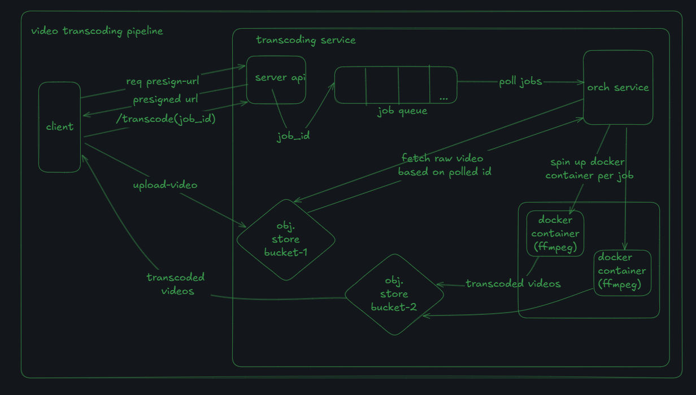

# transcodeX - video transcoder

A scalable **video transcoding service** built using **Node.js/Express.js/typescript**, **Redis and PostgreSQL**, and **Cloudflare R2 (S3 compatible)**.  
This service allows clients to upload videos, queue transcoding jobs, and automatically convert them into multiple resolutions (360p, 480p, 720p, etc.) using **FFmpeg**.

## sys architecture

